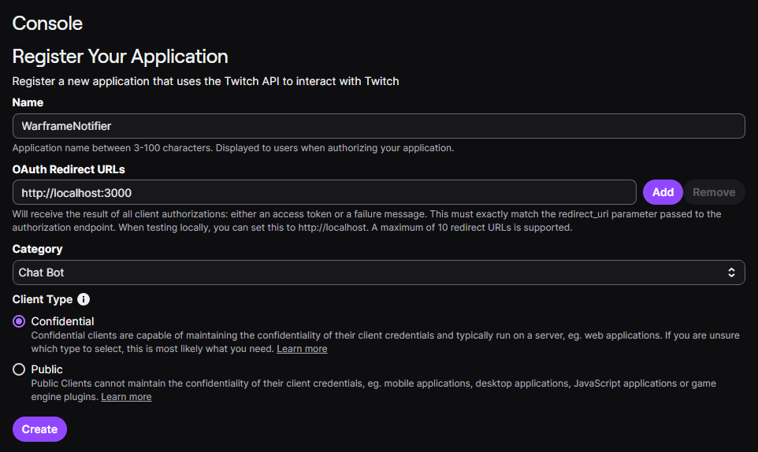
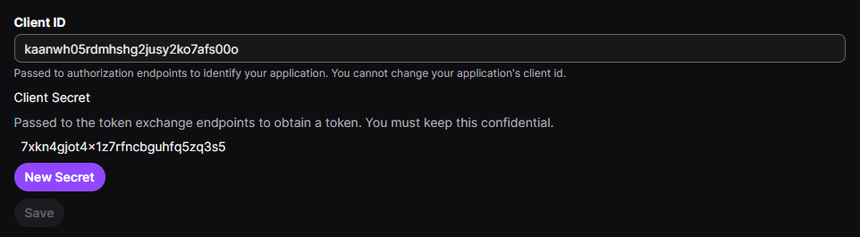
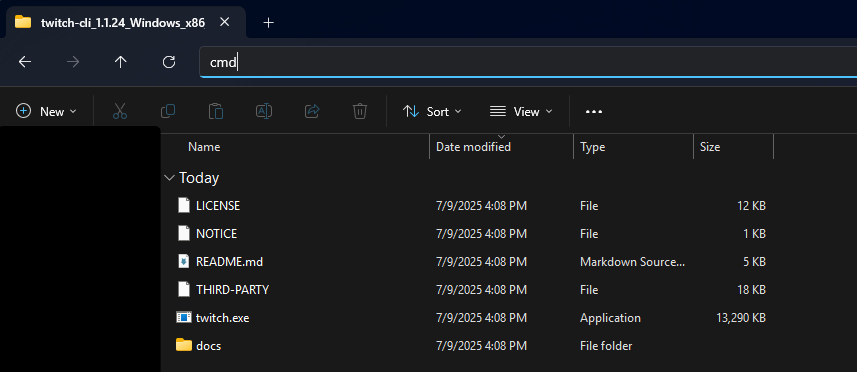
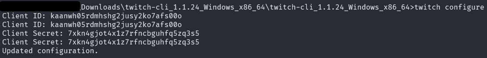
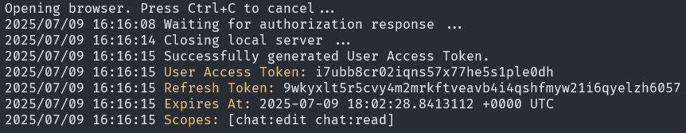
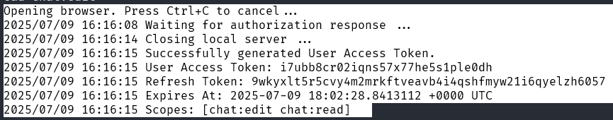

# How to use this?
## 1. Creating your application
1. Head over to the [Twitch Developer Console](https://dev.twitch.tv/console)
2. At the bottom right you'll see "Register Your Application". CLick it.
3. Fill out the form as shown in the screenshot.
   
   IMPORTANT: use `http://localhost:3000` as OAuth redirect URL.


4. Click create.
5. On your newly created App, click "Manage".
6. You'll see a client ID. And at the bottom a button saying "New Secret".

   Click it and copy the newly created secret.


## 2. Getting an access token
1. Download the [Twitch CLI](https://github.com/twitchdev/twitch-cli/releases/download/v1.1.24/twitch-cli_1.1.24_Windows_x86_64.zip)
2. Extract the file, and open a Command Line Prompt in this directory.
   
   This can by done by typing "cmd" in the address bar and pressing enter. (On Windows)
   

3. In the command prompt, type `twitch configure`
   
   After that, it will ask you for your client ID and the secret. Paste those in and hit enter.

4. It should then look like this:
   
   

5. Now type `twitch token -u -s "chat:read chat:edit"`
6. Follow through with the prompts and authorize it.
7. After that it will spit out some text:
8. What you want to do now is mark and copy the text it spit out. 
   
   

## 3. Starting the Notifier
### 1. Setup login
Go in the directory of where your `wf_twitch_notifier.exe` lies and create a text file called `init.txt`.

Paste your copied text from the last step above in that file and save it.

### 2. Initializing the app
Now open a console once again and then use the command `wf_twitch_notifier.exe init --id <PASTE ID HERE> --secret <PASTE SECRET HERE>` (of course, replace the `<placeholders>` with the actual values)

It will now create a file called `.credentials.json` and delete the `init.txt`.

### 3. Configuring the app
Additionally to the `.credentials.json`, it will create a file called `config.json`.

You can edit the `config.json` to change the notifier's behavior.

For example, assuming this is your config: 
```json
{
    "eidolon_hunt_message": true,
    "arbitration_s_tier_message": true,
    "relic_meta_and_disruption_message": true
}
```

Now, let's also say you're not interested in eidolon hunts. You can disable the eidolon hunt messages by setting the second line to `false`, so `"eidolon_hunt_message": false,`.

It would then look like:
```json
{
    "eidolon_hunt_message": false,
    "arbitration_s_tier_message": true,
    "relic_meta_and_disruption_message": true
}
```


### 4. Starting the app
If you've done all the last steps, you can finally run your app. 

In order to run it, use this command:
```
wf_twitch_notifier.exe run <YOUR CHANNEL NAME>
```
(again, replace the `<YOUR CHANNEL NAME>` with the actual values)


## Finalizing
Done. As long as this app runs it'll send notifications when the specified event takes place.

# Feature requests
Have any events you want to have added? Open an Issue in this repository and I'll see what I can do.